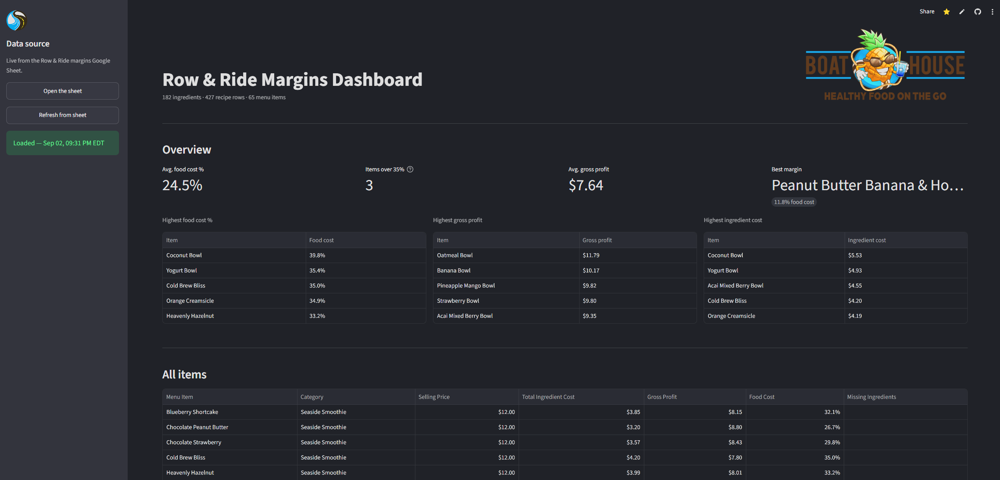

# Boat House Margins Dashboard

A margins dashboard for [Boat House](https://boathouseonthego.com), a smoothie and bowl bar, replacing a hand-maintained Google Sheets cost calculator.



## Why

Boat House runs on Clover for sales and inventory, but Clover doesn't compute what a drink costs to make or its food cost percentage. That math lived in a spreadsheet instead, worked out by hand, so every time an ingredient's price changed someone had to hunt down every menu item that used it and redo the numbers. This tool reads the same spreadsheet and does that recalculation automatically: update one ingredient's cost, and every item it touches is right again on the next refresh.

## How it works

The live data is three Google Sheet tabs: an ingredient database (purchase sizes and costs), a recipe sheet (ingredient amounts per menu item), and a menu list (selling prices). On load, the app:

1. pulls each tab through a read-only service account and validates the required columns, raising a clear error rather than a confusing `KeyError` further down.
2. parses currency strings (`$3.20`, `65%`) into numbers, distinguishing a genuine blank from a malformed value.
3. recomputes each ingredient's **cost per recipe unit** from purchase cost ÷ purchase size. The sheet holds raw inputs only, so a stored per-unit cost would silently keep the old number when a price changes; recomputing means it can't.
4. multiplies by the amount used in each recipe, sums the line costs up per menu item, and derives total ingredient cost, gross profit, and food cost %.

The output is a sortable table plus a few headline stats (average food cost %, items over a food cost % watch threshold, top items by cost and by profit).

## Design decisions

- **Missing cost data returns `None`, never `$0`.** An unpriced or unmatched ingredient is flagged in the UI, since a silent zero would make a margin look healthier than it is.
- **Unit conversions live in one place.** Only two exist: `lbs -> oz` (x16) and a business-specific `tea bags -> fl oz` yield calculation; everything else is same-unit. Each are commented branches in one function.
- **The core math is pure.** `cost_per_recipe_unit`, `calculate_gross_profit`, and the rest take plain numbers and return plain numbers (no pandas, no file I/O) so they're tested directly against known values.
- **Bowl toppings use a representative set.** Bowls sell for one price "including any 4 toppings," but their recipes listed none, so every bowl came out cheaper than it really is with margins to match. Each bowl now carries the four most common toppings as ordinary ingredient lines, flagged in the notes as representative rather than measured.

## Testing

A `pytest` suite covers the pure functions and the full pipeline end to end. The pipeline tests assert against the exact figures from the original hand-maintained Google Sheet, so the port is provably faithful to what the Boat House was already using. The fixtures are frozen snapshots: they don't move when live prices change, so a failing test means the code changed, not the data.

```
python -m pytest
```

## Stack

Python · pandas · Streamlit · gspread · pytest

## Running locally

```
git clone <repo>
cd boat-house-margin-dashboard
pip install -r requirements.txt
python -m streamlit run app.py
```

The Google Sheet is read through a service account. Copy `.streamlit/secrets.toml.example` to `.streamlit/secrets.toml` and fill in a service-account key JSON under `[gcp_service_account]`; the target sheet must be shared with that account as a viewer, but without it the app still starts and explains what's missing.

## Deployment

The live app is private, as it reads a real business's ingredient costs and vendor data.
